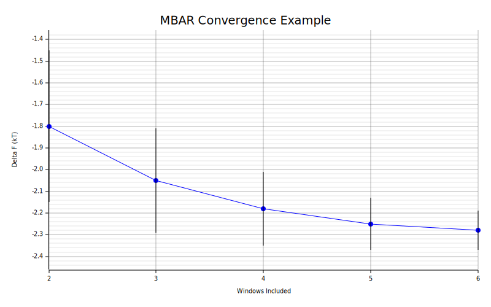
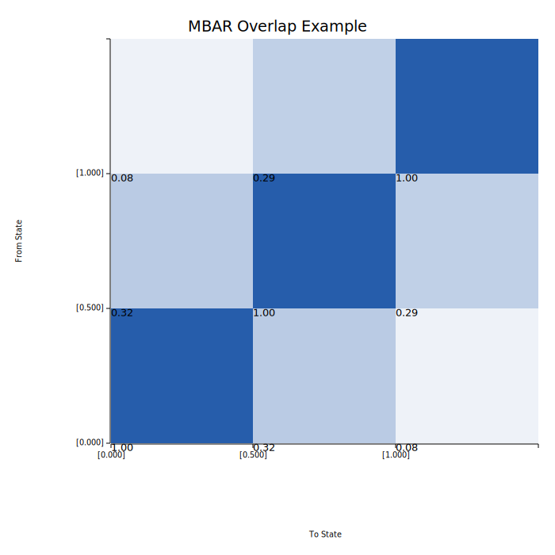
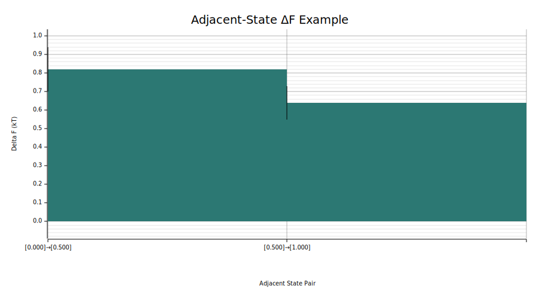
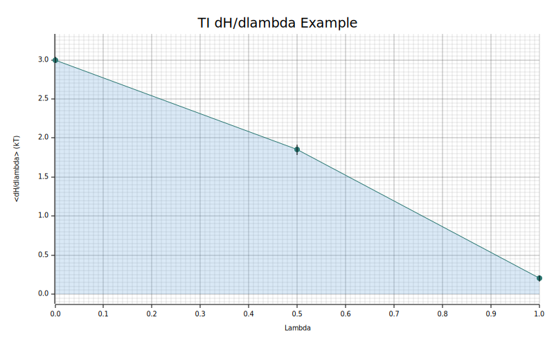

# Plotting

Native plotting is optional in `alchemrs`.

The crate exposes SVG rendering helpers behind the `plotting` Cargo feature:

```bash
cargo add alchemrs --features plotting
```

or for this repository:

```bash
cargo test --features plotting
```

## Current scope

The first plotting surface is intentionally small:

- `render_convergence_svg`
- `render_overlap_matrix_svg`
- `render_delta_f_state_svg`
- `render_ti_dhdl_svg`

These consume plot-ready analysis values and return SVG strings:

- `render_convergence_svg` for `ConvergencePoint`
- `render_overlap_matrix_svg` for `OverlapMatrix`
- `render_delta_f_state_svg` for `DeltaFMatrix`
- `render_ti_dhdl_svg` for `DhdlSeries`

## Example figures

The docs include checked-in SVGs generated with:

```bash
cargo run --example generate_doc_plots --features plotting
```

Convergence trace:



Overlap heatmap:



Adjacent-state `ΔF` plot:



TI `dH/dlambda` plot:



## Example

```rust
use alchemrs::{
    ConvergencePlotOptions, MbarOptions, extract_u_nk, mbar_convergence, render_convergence_svg,
};

# fn main() -> Result<(), Box<dyn std::error::Error>> {
let windows = vec![
    extract_u_nk("lambda0.out", 300.0)?,
    extract_u_nk("lambda1.out", 300.0)?,
];
let points = mbar_convergence(&windows, Some(MbarOptions::default()))?;
let svg = render_convergence_svg(
    &points,
    Some(ConvergencePlotOptions {
        title: "MBAR Convergence".to_string(),
        ..ConvergencePlotOptions::default()
    }),
)?;
assert!(svg.contains("<svg"));
# Ok(())
# }
```

Overlap heatmaps can be rendered directly from the diagnostics layer:

```rust
use alchemrs::{
    MbarOptions, OverlapPlotOptions, extract_u_nk, overlap_matrix, render_overlap_matrix_svg,
};

# fn main() -> Result<(), Box<dyn std::error::Error>> {
let windows = vec![
    extract_u_nk("lambda0.out", 300.0)?,
    extract_u_nk("lambda1.out", 300.0)?,
];
let overlap = overlap_matrix(&windows, Some(MbarOptions::default()))?;
let svg = render_overlap_matrix_svg(
    &overlap,
    Some(OverlapPlotOptions {
        title: "MBAR Overlap".to_string(),
        ..OverlapPlotOptions::default()
    }),
)?;
assert!(svg.contains("<svg"));
# Ok(())
# }
```

Adjacent-state `ΔF` plots can be rendered from estimator results:

```rust
use alchemrs::{
    DeltaFStatePlotOptions, MbarEstimator, MbarOptions, extract_u_nk, render_delta_f_state_svg,
};

# fn main() -> Result<(), Box<dyn std::error::Error>> {
let windows = vec![
    extract_u_nk("lambda0.out", 300.0)?,
    extract_u_nk("lambda1.out", 300.0)?,
];
let delta_f = MbarEstimator::new(MbarOptions::default()).fit(&windows)?;
let svg = render_delta_f_state_svg(
    &delta_f,
    Some(DeltaFStatePlotOptions {
        title: "Adjacent Delta F".to_string(),
        ..DeltaFStatePlotOptions::default()
    }),
)?;
assert!(svg.contains("<svg"));
# Ok(())
# }
```

TI `dH/dlambda` plots can be rendered directly from parsed TI windows:

```rust
use alchemrs::{TiDhdlPlotOptions, extract_dhdl, render_ti_dhdl_svg};

# fn main() -> Result<(), Box<dyn std::error::Error>> {
let series = vec![
    extract_dhdl("lambda0.out", 300.0)?,
    extract_dhdl("lambda1.out", 300.0)?,
];
let svg = render_ti_dhdl_svg(
    &series,
    Some(TiDhdlPlotOptions {
        title: "TI dH/dlambda".to_string(),
        ..TiDhdlPlotOptions::default()
    }),
)?;
assert!(svg.contains("<svg"));
# Ok(())
# }
```

## Why it is feature-gated

Plotting is presentation logic, not core analysis logic. Making it optional keeps:

- the default dependency footprint smaller
- the analysis and estimator surface independent from graphics code
- library usage lightweight for users who only want parsing and estimation
